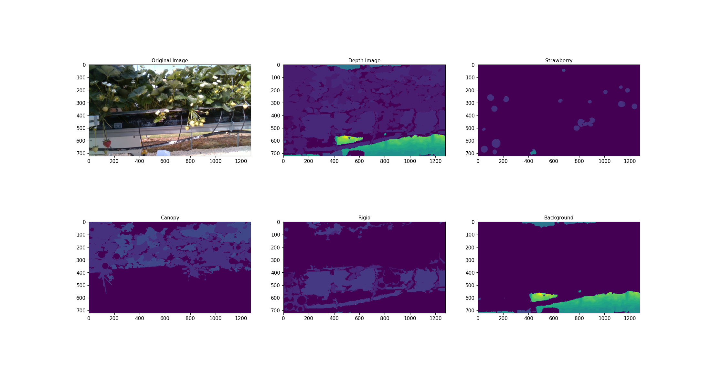

# Mask Predictor

Semantic segmentation of a scene and output corresponding class' depth map



## Requirements
`python3` `torchvision` `pickle` `numpy` `opencv-python` `scikit-image` `matplotlib`
`detectron2`

## Installation

```
https://github.com/usmanzahidi/MaskPredictor.git
```

## Usage

```bash
usage: main.py [-r PATH] [-d PATH]
-r rgb   image folder path
-d depth image folder path

## Example:

```bash
python main.py -r ./images/rgb/file_name.png -d ./images/depth/file_name.png
```
